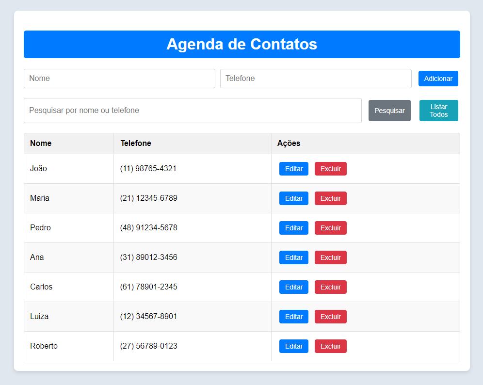

# Agenda Digital de Contatos

Este é um projeto de uma **agenda digital de contatos**, criado para a **Imersão de Desenvolvimento** feita pela **Alura** com o **Google Gemini**, onde você pode adicionar, editar, excluir e pesquisar por contatos.



## 🛠️ Ferramentas Utilizadas

- **HTML**: Estrutura da página.
- **CSS**: Estilização adicional.
- **JavaScript**: Funcionalidades de manipulação de contatos.
- **Bootstrap 5**: Framework para estilização responsiva.
- **Git**: Controle de versão.

## Funcionalidades

- Adicionar novos contatos com nome e telefone.
- Editar informações de um contato existente.
- Excluir contatos da lista.
- Pesquisar contatos por nome ou telefone.

## 🚀 Executando o projeto localmente

### Pré-requisitos

Antes de começar, você vai precisar ter as seguintes ferramentas instaladas na sua máquina:
- [Git](https://git-scm.com) 
- Navegador Web

### Rodando o projeto

Siga os passos abaixo para clonar e executar o projeto localmente:

1. **Clone este repositório**
   ```bash
   git clone https://github.com/layssonsantos/Agenda-Digital.git
2. **Navegue até a pasta do projeto**
   ```bash
   cd Agenda-Digital
3. **Abra o arquivo index.html no navegador**
   No terminal, você pode executar o seguinte comando para abrir o arquivo no navegador:
   ```bash
   start index.html
   ```
   Ou, se estiver usando macOS ou Linux:
   ```bash
   open index.html
